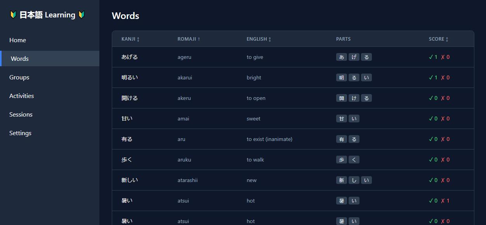

# Free GenAI Bootcamp 2025

The following is a monorepo covering the work and deliverables for the [Free GenAI Bootcamp](https://genai.cloudprojectbootcamp.com/) put on in early 2025 by [Andrew Brown](https://x.com/andrewbrown) and [ExampPro](https://www.exampro.co/).

The playground for this course was a set of projects designed to help English-speaking students learn Japanese. Five weeks of projects integrating generative AI tools included a language learning portal, a podcast transcription and translation app, a Kanji learning game, a containerized text generation service, and a visual novel.

Key Notes for this work:
  - **All materials in this repo are AI-generated, including the code, artwork, designs, specs, scripts, and nearly all documentation.** The creator was only permitted to write prompts and documentation summaries in natural language.
  - By forcing this constraint, this project served as a training exercise in prompt engineering and learning how to use AI tools to generate code and other artifacts.
  - The majority of code was written using Cursor + Sonnet-3.6/7, though at times other tools such as Windsurf, Cline, Aider, ChatGPT, Claude, Perplexity, DeepSeek, Stable Diffusion, and others were used.

This repo is a monorepo for the course projects, including all homework submissions and deliverables. There are a total of 5 weeks of projects, which are best organized in terms of the README files below.

```
free-genai-bootcamp-2025/
├── README.md                          # This file
├── genai-architecting/README.md       # Prew-week: Diagram for GenAI Architecture
├── sentence-constructor/README.md     # Prew-week: Prompt engineering experiments
├── lang-portal/README.md              # Week 1: Language Learning Portal
│   ├── frontend-react/README.md       # Week 1: Frontend for Lang Portal
│   └── games/kanji-snake/README.md    # Week 2: Kanji Learning game via Lang Portal
├── listening-comp/README.md           # Week 2: Podcast Transcription/Translation App
├── opea-comps/README.md               # Week 3: Containerized Text Generation Service
│   └── backend/README.md              # Week 3: Backend for Text Generation Service
└── visual-novel/README.md             # Weeks 4 & 5: Visual Novel
    └── server/README.md               # Weeks 4 & 5: LLM Proxy Server for Visual Novel
```

## Pre-week (02/01-02/07)

This week introduced the course, including the resources and tools we would be using. We discussed archicture diagrams for GenAI applications (TOGAF, Mermaid diagrams), concepts like RAG, caching, and guardrails, and the state of the industry in terms of key players and platforms. We were tasked with creating a diagram of a generative AI application architecture as well as experiment with multiple LLM providers to determine each of their capabilities and limitations. I accomplished both, testing Markdown, YAML, and XML prompt formats across four commerical models (OpenAI, AnthropicAI, DeepSeek V3 & R1) as well as five local models (Phi-4, Qwen2.5-1M-14B, Mistral-Small-24B, and R1-Distilled Llama-8B, and R1-distilled Qwen 2.5-1.5B) toward our Japanese language learning objectives.


### Homework Projects (README file links)
- [genai-architecting](genai-architecting/README.md)
- [sentence-constructor](sentence-constructor/README.md)

### Learning Focus
    - LM Studio & Open-weight models
    - Lucid Charts

### Homework Submission
- Hypothesis and Technical Uncertainty
    - Our primary concern regarding technical uncertainty was two-fold. First, since we hope that this could be an application that runs locally on a user's machine, we were uncertain whether local, open-weight models would be sufficient for supporting the features we are looking to build. Second, for larger SaaS models we were not as much concerned about capability but rather how to achieve optimal prompt design and format for the data that the app will need to retrieve. To aid this, we did a deeper investigation into the Japanese language to determine the salient decision points regarding translation that informed prompt design. Our key technical questions included: (1) How to structure prompts to account for Japanese language complexities (formality levels, writing systems, user proficiency), (2) Which prompt format (XML, YAML, Markdown) would work best across different LLM providers, and (3) How to balance between SaaS and local open-weight model deployment options.
- Technical Exploration
    - We documentation our Japanese language considerations to inform prompt design (formality levels, writing systems, JLPT levels), developed and tested three different prompt formats (XML, YAML, Markdown) across multiple LLM models including: - Large SaaS models (Claude, ChatGPT, DeepSeek SaaS) - Mid-size models (Mistral, Llama, DeepSeek Distills) - Smaller local models (8B, 1.5B parameter versions) We worked iteratively with Claude Sonnet 3.5 and DeepSeek R1 to craft LLM-directed prompts in each format and ran all three against a battery of test models, recording results in the respective prompt-*.md files. We recognize that this was not as the assignment was prescribed, but we felt it fit our direction, where we plan to perform a good amount of post-processing on the LLM results to support the app (see README in the architecture folder). We documented architectural components and other technical design considerations.
- Final Outcomes
    - Determined that a simplified "two-level" approach (Default/Beginner) would be more effective than mapping to JLPT levels.
    - Found that Markdown format generally performed best across models, both locally and with paid SaaS services.
    - Discovered that only two models in our format/model test matrix rendered our test prompt perfectly, and both were local models:
        - MD & Mistral Small 24B Instruct 2501 13B Q6_K_L
        - YAML & DeepSeek R1 Distill Llama 8B Q6_K_L
    - Identified Japanese-specific models (2B-70B parameter range) potentially suitable for local deployment (but requiring further investigation).
    - Established clear separation between prompt engineering and application post-processing to maintain flexibility.

## Week 1 - Generative AI Development & Dev Tools (02/08-02/14)

Our project this week was the Language Learning Portal, which was presented as a web application with a FastAPI backend and a React frontend. A sample backend was provided that required implementation of a few endpoints to support the frontend. An extra challenge was issued to write the backend and frontend from scratch (as well as only through using AI tools), which I accomplished.



### Homework Projects (README file links)
- [lang-portal](lang-portal/README.md)
- [lang-portal/frontend-react](lang-portal/frontend-react/README.md)

### Learning Focus
    - Cursor in WSL
    - FastAPI
    - Alembic, Mermaid diagrams
    - Vite
    - React/TailwindCSS

### Homework Submission
- Backend API Implementation
    - I wrote the backend from scratch in FastAPI, which I have never used before and took it as an extra challenge.
    - This included scripts for constructing and seeding the database, with management via Alembic (also new to me).
    - I have never used alembic, sqlalchemy, pytest, black, or ruff before. (I do work with Python, but mostly in Jupyter notebooks).
    - I used Cursor with WSL, and I wrote no code - I worked with it via spec docs and prompts to guide me through the full process, which was also a new experience and extra challenge for me.
    - Backend is complete with automated tests and 86% code coverage.
- Frontend API Implementation
    - I wrote the frontend from scratch in React. I have some experience with React, but not for a full website (just poking around with the basics).
    - I have never used Vite, yarn, or TailwindCSS before. I have never coded a project in TypeScript (but i do work with JavaScript).
    - Again, I used Cursor with WSL, and I wrote no code myself. I spent years learning computer science and programming, but English is now my new coding language.
    - Frontend basic structure is complete and the website runs, but I was not able to complete design and styling or make it fully functional with the backend at the time of submission (Week 2 live stream). I will complete it today after the lesson.
- Vocab Importer Implenetation
    - I started with the seeding data included in the sample project, and created other seeding files to support the automated tests. I created a set of Python dev scripts that will create the db from the alembic schema and then seed the database with the data from the files in the /data directory.

## Week 2 - Multi-Modalities (02/15-02/21)

This week we ventured into multi-modal generative AI, including audio and images. Our task was to create an application that pulled transcripts from the YouTube API for videos in Japanese and provided an interface for studying them. With some flexibility in the project permitted, I created a Streamlit application that enables users to provide a Japanese language audio file (either via URL or mp3 upload), which is then transcribed and translated into English. An embedded player breaks the source (e.g., Japanese podcast) into individual statements that can be studied individually with the transcript and translation in time-sync. We leverage commercial LLM models via API calls.


Additionally, we were tasked with creating a learning activity for studying the written Japanese language(specifically, hiragana and katakana). I extended the Lang Portal to offer a "game template" that can be used to create Phaser games independently of the Lang Portal, but later import them as activities that (through the LangPortal library) can take advantage of the Lang Portal's features such as word lists, groups, and session records. To demonstrate this, I developed a Kanji-learning game called Kanji Snake, which is a standalone web-based game that I then imported into the Lang Portal as a new "Activity."


### Homework Projects (README file links)
- [listening-comp](listening-comp/README.md)
- [lang-portal/games/kanji-snake](lang-portal/games/kanji-snake/README.md)

### Learning Focus
    - OpenAI API
    - Streamlit
    - TinyDB
    - Phaser
    - Stable Diffusion

### Homework Submission
- Language Listening App
    - My Listening Learning App is a podcast (or other Japanese audio) transcription and translation app. You can provide a URL or upload a local file.
    - Files can be processed for both time-coded transcription and time-coded English translation using OpenAI API (which I've never used)
    - The Study page allows learners to follow along with the podcast, reading the Japanese and English side-by-side with the audio. Syncing with audio is still WIP.
    - App is written using Streamlit (which I've never used) and TinyDB (which I've never used)
    - Written entirely with no manual coding, all AI-developed via Cursor on WSL
- Kana Practice App
    - My Kana Practice app is instead a Kanji Practice app, implemented in the form of a game "Kanji Snake" in the Lang Portal
    - I developed a framework for importing standalone web-based games into the lang portal so they can serve as new "Activities", using the backend's API for learning content.
    - Kanji Snake was the demonstration of this process, written in Phazer (passing knowledge) and starting with a "base game" template.
    - Written entirely with no manual coding, all AI-developed via Cursor on WSL and Stable Diffusion
    - https://github.com/rcgray/free-genai-bootcamp-2025/tree/main/lang-portal/games/kanji-snake

## Week 3 - Containers and Agents (02/22-02/28)

Week 3 explored development and deployment options for generative AI applications, including containers and agents. We built a containerized text generation service using Docker, Intel's OPEA platform, and ggerganov/llama.cpp that could provide a ChatGPT-like experience. My app supports any local GGUF model you have available, but I tested with Llama 3.1-8B, Llama-3.2-1B, Llama-3.2-3B, and Phi-4.


### Homework Projects (README file links)
- [opea-comps](opea-comps/README.md)
- [opea-comps/backend](opea-comps/backend/README.md)

### Learning Focus
    - Docker
    - OPEA
    - LLama.cpp

### Homework Submission
- Describe your progress with OPEA
    - I'm really interested in local LLMs, so my personal goal was to get the OPEA chat to work with a local gguf via a ggerganov/llama.cpp container as its TGI Service.
    - I wanted to build the app free from any dependence on HuggingFace, including the This gives the flexibility of defining any LLM you want, not just those offered by the named HF options. For instance, you can bring in a custom tuned model or one built for Japanese language like Gemma 2-JPN or Stablity AI's beta/gamma versions.
    - We then built a Streamlit app to consume our local textgen service, deployed via Docker, giving us a UI in which to chat with our local model.
    - Learning:
    - I have never used Docker before, so I had to go on a little Udemy journey last week.
    - I have limited experience with llama.cpp, where I more just use applications (Kobold, LMStudio) or other libraries (ollama) that wrap it, but it was cool to learn!
    - My own constraint: As with everything up to date, I have written zero code myself - everything is AI created (via Cursor, Cline, Aider, Claude, OpenAI, DeepSeek, Perplexity, Stable Diffusion, and so on) to force myself to learn how to prompt. It has been very tricky at times (especially with this week's project), but that has been my strongest skill growth.

## Weeks 4 & 5 - Capstone Project (03/01-03/07)

For our capstone project, we were tasked with creating an immersive language-learning activity that leveraged generative AI. I chose to build a visual novel using the Phaser game engine to create a narrative experience that introduces Japanese language and culture through a visit to a friend living in Japan. Every piece of text in the game can be dynamically examined by the player to provide additional information and context, powered by an LLM proxy server that can be configured to use different LLM models - both commercial via API or any local GGUF model you have available. The game and supporting tech were created entirely by AI via prompt engineering, including all code, artwork, UI, game design, story, dialogue, and teaching materials.


### Homework Projects (README file links)
- [visual-novel](visual-novel/README.md)
- [visual-novel/server](visual-novel/server/README.md)

### Learning Focus
    - Streamlit
    - Phaser
    - LLM Services (OpenAI, Ollama, etc.)

### Homework Submission

    - TBD


## License

This project is licensed under the MIT License - see the [LICENSE](LICENSE) file for details

[](LICENSE)