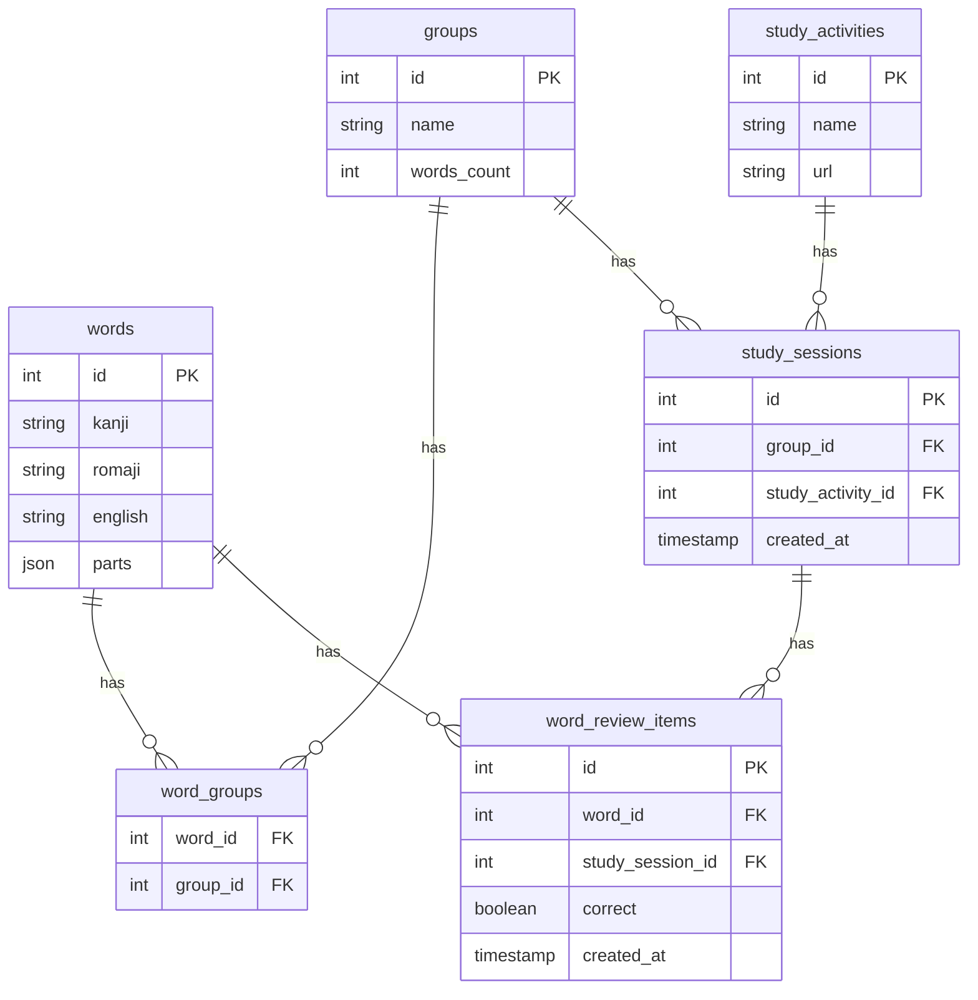

# Backend Server Technical Specs

## Project Goal

A language learning school wants to build a learning portal website which will act as three things:
1. Inventory of possible vocabulary that can be learned
2. Act as a Learning record store (LRS), providing correct and wrong score on practice vocabulary
3. A unified launchpad to launch different learning apps

## Project General Specifications

- Single-Page Application (SPA) web application
- FastAPI (Python 3.12) for the backend
- React.js (TypeScript) for the frontend
- Use SQLite3 (SQL) as the database
- The API will always return JSON (API spec below)
- No authentication/authorization, assume there is only a single user
- Developed with the aid of AI-coding assistants, particularly Cursor

## Backend API Specification

### General Guidelines
- All routes are prefixed with `/api`, e.g. `/api/words`
- All routes return JSON, including errors
- Standard response format:
```json
{
    "data": {},
    "error": null
}
```

### API Routes

#### GET /api/words
Get paginated list of words with review statistics

Query Parameters:
- `page`: Integer, Page number (default: 1)
- `per_page`: Integer, Items per page (default: 20, max: 100)
- `sort_by`: String, Sort field ('kanji', 'romaji', 'english', 'correct_count', 'wrong_count') (default: 'romaji')
- `order`: String, Sort order ('asc' or 'desc') (default: 'asc')

Response:
```json
{
    "data": {
        "items": [...],
        "total": 0,
        "page": 1,
        "per_page": 20,
        "total_pages": 0
    },
    "error": null
}
```

#### GET /api/groups
Get paginated list of word groups with word counts

Query Parameters:
- `page`: Integer, Page number (default: 1)
- `per_page`: Integer, Items per page (default: 20, max: 100)
- `sort_by`: String, Sort field ('name', 'words_count') (default: 'name')
- `order`: String, Sort order ('asc' or 'desc') (default: 'asc')

Response:
```json
{
    "data": {
        "items": [{
            "id": 0,
            "name": "string",
            "words_count": 0
        }],
        "total": 0,
        "page": 1,
        "per_page": 20,
        "total_pages": 0
    },
    "error": null
}
```

#### GET /api/groups/:id
Get words from a specific group (This is intended to be used by target apps)

Path Parameters:
- `id`: Integer, Group ID

Query Parameters:
- `page`: Integer, Page number (default: 1)
- `per_page`: Integer, Items per page (default: 20, max: 100)
- `sort_by`: String, Sort field ('kanji', 'romaji', 'english') (default: 'romaji')
- `order`: String, Sort order ('asc' or 'desc') (default: 'asc')

Response:
```json
{
    "data": {
        "group": {
            "id": 0,
            "name": "string",
            "words_count": 0
        },
        "words": {
            "items": [...],
            "total": 0,
            "page": 1,
            "per_page": 20,
            "total_pages": 0
        }
    },
    "error": null
}
```

#### POST /api/study_sessions
Create a new study session for a group

Request Body:
```json
{
    "group_id": 0,
    "study_activity_id": 0
}
```

Response:
```json
{
    "data": {
        "id": 0,
        "group_id": 0,
        "study_activity_id": 0,
        "created_at": "2024-03-20T12:00:00Z"
    },
    "error": null
}
```

#### POST /api/study_sessions/:id/review
Log a review attempt for a word during a study session

Path Parameters:
- `id`: Integer, Study session ID

Request Body:
```json
{
    "word_id": 0,
    "correct": true
}
```

Response:
```json
{
    "data": {
        "id": 0,
        "word_id": 0,
        "study_session_id": 0,
        "correct": true,
        "created_at": "2024-03-20T12:00:00Z"
    },
    "error": null
}
```

## Project Structure

```
/backend-fastapi/
├── alembic/                    # Database migrations
│   └── versions/
├── app/
│   ├── __init__.py
│   ├── main.py                # FastAPI application entry point
│   ├── core/
│   │   ├── __init__.py
│   │   ├── config.py          # Application configuration
│   │   ├── database.py        # Database connection handling
│   │   └── exceptions.py      # Custom exception handlers
│   ├── api/
│   │   ├── __init__.py
│   │   ├── v1/
│   │   │   ├── __init__.py
│   │   │   ├── endpoints/
│   │   │   │   ├── __init__.py
│   │   │   │   ├── words.py
│   │   │   │   ├── groups.py
│   │   │   │   └── study_sessions.py
│   │   │   └── router.py
│   │   └── deps.py            # Dependency injection
│   ├── models/
│   │   ├── __init__.py
│   │   ├── word.py
│   │   ├── group.py
│   │   ├── study_activity.py
│   │   └── study_session.py
│   ├── schemas/
│   │   ├── __init__.py
│   │   ├── word.py
│   │   ├── group.py
│   │   ├── study_session.py
│   │   └── common.py
│   ├── crud/
│   │   ├── __init__.py
│   │   ├── base.py
│   │   ├── word.py
│   │   ├── group.py
│   │   └── study_session.py
│   └── services/
│       ├── __init__.py
│       └── study_service.py
├── tests/
│   ├── __init__.py
│   ├── conftest.py
│   ├── test_api/
│   │   └── test_v1/
│   │       ├── test_words.py
│   │       ├── test_groups.py
│   │       └── test_study_sessions.py
│   └── test_crud/
├── .env                       # Environment variables
├── .gitignore
├── alembic.ini                # Alembic configuration
├── pyproject.toml             # Project metadata and dependencies
└── README.md
```


## Database Schema

### SQLite Implementation Notes
- BOOLEAN fields are implemented as INTEGER (0 or 1)
- JSON fields are stored as TEXT
- Recommended indexes:
  - `word_groups`: (word_id, group_id)
  - `word_review_items`: (word_id), (study_session_id)
  - `study_sessions`: (group_id), (study_activity_id)

The following is the schema of the database, written in Mermaid format:



## Table Descriptions

**words** — Stores individual Japanese vocabulary words.
- `id` (INTEGER PRIMARY KEY): Unique identifier for each word
- `kanji` (TEXT NOT NULL): The word written in Japanese kanji
- `romaji` (TEXT NOT NULL): Romanized version of the word
- `english` (TEXT NOT NULL): English translation of the word
- `parts` (JSON NOT NULL): Word components stored in JSON format
Foreign Key Relationships:
- Has many word_groups
- Has many word_review_items

**groups** — Manages collections of words.
- `id` (INTEGER PRIMARY KEY): Unique identifier for each group
- `name` (TEXT NOT NULL): Name of the group
- `words_count` (INTEGER DEFAULT 0): Counter cache for the number of words in the group
Foreign Key Relationships:
- Has many word_groups
- Has many study_sessions

**word_groups** — Junction table enabling many-to-many relationship between words and groups.
- `word_id` (INTEGER NOT NULL): References words.id
- `group_id` (INTEGER NOT NULL): References groups.id
Foreign Key Relationships:
- Belongs to words
- Belongs to groups
Note: Composite primary key of (word_id, group_id) is recommended

**study_activities** — Defines different types of study activities available.
- `id` (INTEGER PRIMARY KEY): Unique identifier for each activity
- `name` (TEXT NOT NULL): Name of the activity (e.g., "Flashcards", "Quiz")
- `url` (TEXT NOT NULL): The full URL of the study activity
Foreign Key Relationships:
- Has many study_sessions

**study_sessions** — Records individual study sessions.
- `id` (INTEGER PRIMARY KEY): Unique identifier for each session
- `group_id` (INTEGER NOT NULL): References groups.id
- `study_activity_id` (INTEGER NOT NULL): References study_activities.id
- `created_at` (TIMESTAMP DEFAULT CURRENT_TIMESTAMP): When the session was created
Foreign Key Relationships:
- Belongs to groups
- Belongs to study_activities
- Has many word_review_items

**word_review_items** — Tracks individual word reviews within study sessions.
- `id` (INTEGER PRIMARY KEY): Unique identifier for each review
- `word_id` (INTEGER NOT NULL): References words.id
- `study_session_id` (INTEGER NOT NULL): References study_sessions.id
- `correct` (BOOLEAN NOT NULL): Whether the answer was correct
- `created_at` (TIMESTAMP DEFAULT CURRENT_TIMESTAMP): When the review occurred
Foreign Key Relationships:
- Belongs to words
- Belongs to study_sessions

## Relationships

- Words to Word Groups (1:N): A word can belong to multiple groups through the word_groups junction table
- Groups to Word Groups (1:N): A group can contain multiple words through the word_groups junction table
- Groups to Study Sessions (1:N): A group can have multiple study sessions
- Study Activities to Study Sessions (1:N): A study activity type can be used in multiple study sessions
- Study Sessions to Word Review Items (1:N): A study session can have multiple word review items
- Words to Word Review Items (1:N): A word can have multiple review items across different study sessions

Key junction tables:
- word_groups: Manages the many-to-many relationship between words and groups
- word_review_items: Tracks individual word reviews within study sessions

## Design Notes

- All tables use auto-incrementing primary keys
- Timestamps are automatically set on creation where applicable
- Foreign key constraints maintain referential integrity
- JSON storage for word parts allows flexible component storage
- Counter cache on groups.words_count optimizes word counting queries
- Database transactions should be used when:
  - Creating word reviews
  - Updating word counts in groups
