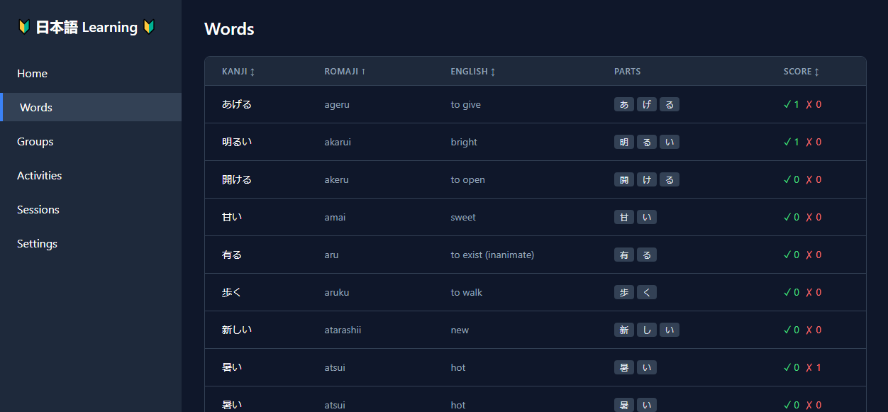

# Language Learning Portal

A web-based language learning platform that serves as:
1. A vocabulary management system
2. A learning record store (LRS)
3. A unified launchpad for various learning applications



## Overview

The Language Learning Portal is a comprehensive web application designed to help users learn Japanese. It provides tools for vocabulary management, tracks learning progress, and serves as a central hub for launching various educational activities and games.

## Technology Stack

### Backend
- FastAPI (Python 3.12)
- SQLite3 database
- RESTful JSON API
- SQLAlchemy for ORM
- Alembic for database migrations
- uv for Python package management

### Frontend
- React 18+ with TypeScript
- Vite for build tooling
- TailwindCSS for styling
- React Query for API state management
- React Router for navigation

## Getting Started

### Prerequisites
- Python 3.12 or higher
- optional: uv package manager (`pip install uv`)
- Yarn package manager
- Node.js 18 or higher (for yarn)

### Installation

1. Clone the repository
```bash
git clone https://github.com/yourusername/lang-portal.git
cd lang-portal

# Copy environment file and configure if needed
cp .env.example .env
```

2. Set up the backend
```bash
# Navigate to backend directory
cd backend-fastapi

# Create and activate virtual environment using uv
uv venv
  # or regular venv
  python -m venv .venv

source .venv/bin/activate  # On Windows: .venv\Scripts\activate

# Install production dependencies using uv
uv sync
  # or regular pip
  pip install -e .
```

3. Initialize and seed the database
```bash
# Return to project root
cd ..
# Create a new database with schema
python scripts/db/init_db.py --force
# Seed the database with initial data
python scripts/db/seed_db.py
```
As a backup, a copy of a fresh database is available in `data/empty.db` that you can simply copy to `lang_portal.db` and start using immediately.

4. Set up the frontend
```bash
# Navigate to frontend directory
cd frontend
yarn install
```

### Running the Application

#### Development Mode

Start both backend and frontend development servers:

Backend:
```bash
cd backend-fastapi
uvicorn app.main:app --reload
```

Frontend:
```bash
cd frontend-react
yarn dev
```

The application will be available at:
- Frontend: http://localhost:3000
- Backend API: http://localhost:8000
- API Documentation: http://localhost:8000/docs

#### Production Mode

Build the frontend:
```bash
cd frontend-react
yarn build
```

Start the backend:
```bash
cd backend-fastapi
uvicorn app.main:app
```

### Docker Setup

The application can also be run using Docker containers for easier deployment and consistent environments.

#### Prerequisites
- Docker and Docker Compose installed on your machine

#### Running with Docker

1. From the repository root (not the lang-portal directory), start the application with Docker Compose:
```bash
# Navigate to repository root if needed
cd /path/to/free-genai-bootcamp-2025

# Start only the Language Portal services
docker compose --profile lang_portal up -d
```

2. The application will be available at:
- Frontend: http://localhost:3000
- Backend API: http://localhost:8000
- API Documentation: http://localhost:8000/docs

3. To stop the containers:
```bash
docker compose --profile lang_portal down
```
⚠ Note: Some environments (like certain Docker Compose versions within WSL) may require explicitly specifying profiles when stopping services via the command line. If the above command doesn't work from your terminal, try stopping containers via the Docker Desktop GUI.

#### Container Details

The application is split into two containers:
- `lang-portal-backend`: FastAPI backend service
- `lang-portal-frontend`: React frontend served through Nginx

Both containers are configured to restart automatically unless explicitly stopped.

#### Data Persistence

The backend container uses a Docker volume (`lang_portal_data`) to persist the SQLite database. This ensures your data remains intact between container restarts.

#### Environment Configuration

The backend container uses the following environment variables:
- `DATABASE_URL`: Path to the SQLite database
- `API_V1_PREFIX`: Prefix for API routes
- `ENVIRONMENT`: Deployment environment (development/production)
- `DEBUG`: Enable/disable debug mode
- `FRONTEND_URL`: URL of the frontend application

You can customize these by editing the `docker-compose.yml` file.

### Developer Setup

For development, you'll need additional dependencies:

```bash
# Install development dependencies using uv
uv pip install -e ".[dev]"
  # or regular pip
  pip install -e ".[dev]"
```

This will install additional packages needed for development:
- pytest and pytest-asyncio for testing
- black for code formatting
- isort for import sorting
- mypy for type checking
- ruff for linting

### Testing

Run all tests:
```bash
# Backend tests
cd backend-fastapi
uv run pytest -v tests/
  # or regular pip
  python -m pytest tests/
# Frontend tests
cd frontend
yarn test
```

### Code Quality

Format and lint the code:
```bash
# Backend
cd backend-fastapi
uv run black .
uv run isort .
uv run mypy .
uv run ruff check .

# Frontend
cd frontend
yarn lint
yarn format
```

## Project Structure

```
lang-portal/
├── backend-fastapi/        # Backend FastAPI application
│   ├── app/                # Application code
│   │   ├── core/           # Core components (config, database)
│   │   ├── api/            # API routes
│   │   ├── models/         # SQLAlchemy models
│   │   ├── schemas/        # Pydantic models
│   │   ├── crud/           # Database operations
│   │   └── services/       # Business logic
│   ├── alembic/            # Database migrations
│   │   ├── versions/       # Migration scripts
│   │   └── env.py          # Alembic configuration
│   ├── seed/               # Seed data files
│   │   ├── words.*.json          # Word data files (verbs, adjectives, etc.)
│   │   ├── groups.json           # Group definitions
│   │   ├── word_groups.json      # Word-group associations
│   │   └── study_activities.json # Study activity definitions
│   └── tests/              # Backend tests
├── frontend/               # Frontend React application
├── games/                  # Educational games
│   └── kanji-snake/        # Example game implementation
├── shared/                 # Shared code for games
│   ├── api-client/         # API client library
│   └── types/              # Shared TypeScript types
├── scripts/                # Development and utility scripts
│   └── db/                 # Database management scripts
│       ├── init_db.py      # Database initialization
│       └── seed_db.py      # Database seeding
├── docs/                   # Documentation
└── data/                   # Database and data files
    └── lang_portal.db      # SQLite database file
```

## Database Management

The project uses SQLite with SQLAlchemy ORM and Alembic for migrations.

### Database Setup

1. Initialize a new database:
```bash
python scripts/db/init_db.py --force
```
This will:
- Create a new SQLite database in `data/lang_portal.db`
- Run all Alembic migrations to create the schema

2. Seed the database with initial data:
```bash
python scripts/db/seed_db.py
```
This will populate the database with:
- Words (verbs and adjectives)
- Groups (e.g., "Verbs", "Adjectives")
- Word-group associations
- Study activities

### Working with Migrations

Create a new migration:
```bash
cd backend-fastapi
alembic revision --autogenerate -m "Description of changes"
```
Apply migrations:
```bash
alembic upgrade head
```

Revert migrations:
```bash
alembic downgrade -1  # Revert last migration
alembic downgrade base  # Revert all migrations
```

## API Documentation

Once the development server is running, API documentation is available at:
- Swagger UI: http://localhost:8000/docs
- ReDoc: http://localhost:8000/redoc

## Development Tools

The project includes several development tools and scripts:

1. Database Management
   - Database initialization and migrations (Alembic)
   - Data seeding utilities
   - Backup/restore utilities

2. Testing Tools
   - Unit tests (pytest)
   - Integration tests
   - E2E tests
   - Coverage reports

3. Documentation
   - API documentation (OpenAPI/Swagger)
   - Frontend component documentation
   - Development guides

4. Code Quality Tools
   - Code formatting (black, prettier)
   - Linting (mypy, eslint)
   - Type checking (mypy, TypeScript)


## Game Development

The platform supports the development of educational games that integrate with the learning management system. Each game is a standalone React application that can be developed independently and later integrated into the frontend.

### Creating a New Game

1. Copy the base game template:
```bash
# From project root
cp -r games/base-game games/your-game-name
cd games/your-game-name
```
The game name that you choose (i.e., the name of the directory) is important because it will be used to identify the game in the database and in the URL.

2. Update the package configuration:
```bash
# Update package.json
# - Change "name" to "@lang-portal/your-game-name"
# - Update other metadata as needed
```

3. Install dependencies:
```bash
yarn install
```

### Development Workflow

Games can be developed in two modes:

#### Standalone Development
For active development of the game itself:
```bash
# From game directory (e.g., games/your-game-name)
yarn dev
```
This will:
- Start a development server (default: http://localhost:5173)
- Provide a standalone development environment
- Hot reload changes
- Simulate the frontend integration environment
- Allow testing game mechanics and API integration
- A form will be provided to allow you to add the game to the database

#### Frontend Integration
For testing the game within the main application:
```bash
# From project root
yarn dev:games  # Build all games an integrate into frontend
```
This will:
- Build the game as a library
- Copy it to the frontend's public directory
- Make it available through the Activities page


### Game Interface

Your game must implement the following interface:
```typescript
interface GameProps {
  apiClient: ApiClient;      // API client for backend communication
  sessionId?: string;        // Current session ID
  onGameComplete?: () => void; // Callback when game completes
}
```

The base game template provides:
- Basic project structure and configuration
- TypeScript and build setup
- Example implementation of the game interface
- Integration with the shared API client
- Development environment for standalone testing

### Development Guidelines

1. Use the shared API client for backend communication
2. Implement proper session management
3. Call `onGameComplete` when the game ends
4. Follow React and TypeScript best practices
5. Add appropriate error handling
6. Include loading states
7. Make your game responsive

