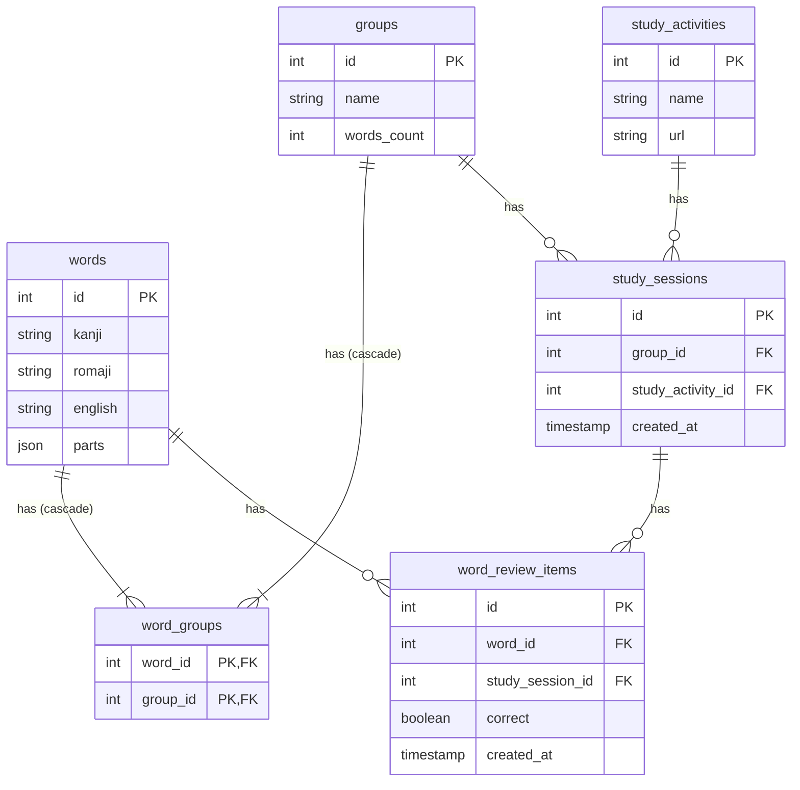

# Backend Server Technical Specs

## Project Goal

A language learning school wants to build a learning portal website which will act as three things:
1. Inventory of possible vocabulary that can be learned
2. Act as a Learning record store (LRS), providing correct and wrong score on practice vocabulary
3. A unified launchpad to launch different learning apps

## Project General Specifications

- Single-Page Application (SPA) web application
- FastAPI (Python 3.12) for the backend
- React.js (TypeScript) for the frontend
- Use SQLite3 (SQL) as the database
- The API will always return JSON (API spec below)
- No authentication/authorization, assume there is only a single user
- Developed with the aid of AI-coding assistants, particularly Cursor

## Backend API Specification

### General Guidelines
- All routes are prefixed with `/api`, e.g. `/api/words`
- All routes return JSON, including errors
- Standard response format:
```json
{
    "data": {},
    "error": null
}
```

### API Routes

#### Words

##### GET /api/words
Get paginated list of words with review statistics

Query Parameters:
- `page`: Integer, Page number (default: 1)
- `per_page`: Integer, Items per page (default: 20, max: 100)
- `sort_by`: String, Sort field ('kanji', 'romaji', 'english', 'correct_count', 'wrong_count') (default: 'romaji')
- `order`: String, Sort order ('asc' or 'desc') (default: 'asc')

Response:
```json
{
    "data": {
        "items": [{
            "id": 0,
>>            "kanji": "新しい",
            "romaji": "atarashii",
            "english": "new",
            "parts": [
                { "kanji": "新", "romaji": ["a","ta","ra"] },
                { "kanji": "し", "romaji": ["shi"] },
                { "kanji": "い", "romaji": ["i"] }
            ],
            "correct_count": 0,
            "wrong_count": 0
        }],
        "total": 1,
        "page": 1,
        "per_page": 20,
        "total_pages": 1
    },
    "error": null
}
```

##### POST /api/words
Create a new word

Request Body:
```json
{
    "kanji": "新しい",
    "romaji": "atarashii",
    "english": "new",
    "parts": [
        { "kanji": "新", "romaji": ["a","ta","ra"] },
        { "kanji": "し", "romaji": ["shi"] },
        { "kanji": "い", "romaji": ["i"] }
    ],
}
```

##### PUT /api/words/{word_id}
Update an existing word

Request Body:
```json
{
    "kanji": "悪い",
    "romaji": "warui",
    "english": "bad",
    "parts": [
        { "kanji": "悪", "romaji": ["wa","ru"] },
        { "kanji": "い", "romaji": ["i"] }
    ]
}
```

##### DELETE /api/words/{word_id}
Delete a word

#### Groups

##### GET /api/groups
Get paginated list of word groups

Query Parameters:
- `page`: Integer, Page number (default: 1)
- `per_page`: Integer, Items per page (default: 20, max: 100)
- `sort_by`: String, Sort field ('name', 'words_count') (default: 'name')
- `order`: String, Sort order ('asc' or 'desc') (default: 'asc')

Response:
```json
{
    "data": {
        "items": [{
            "id": 1,
            "name": "Animals",
            "words_count": 10
        }],
        "total": 1,
        "page": 1,
        "per_page": 20,
        "total_pages": 1
    },
    "error": null
}
```

##### GET /api/groups/{group_id}
Get words from a specific group

Query Parameters:
- `page`: Integer, Page number (default: 1)
- `per_page`: Integer, Items per page (default: 20, max: 100)
- `sort_by`: String, Sort field ('kanji', 'romaji', 'english') (default: 'romaji')
- `order`: String, Sort order ('asc' or 'desc') (default: 'asc')

Response:
```json
{
    "data": {
        "group": {
            "id": 1,
            "name": "Animals",
            "words_count": 2
        },
        "words": {
            "items": [{
                "id": 1,
                "kanji": "猫",
                "romaji": "neko",
                "english": "cat",
                "parts": [
                    { "kanji": "猫", "romaji": ["ne","ko"] },
                ],
                "correct_count": 5,
                "wrong_count": 1
            }, {
                "id": 2,
                "kanji": "犬",
                "romaji": "inu",
                "english": "dog",
                "parts": [
                    { "kanji": "犬", "romaji": ["in","u"] },
                ],
                "correct_count": 3,
                "wrong_count": 0
            }],
            "total": 2,
            "page": 1,
            "per_page": 20,
            "total_pages": 1
        }
    },
    "error": null
}
```

##### POST /api/groups
Create a new group

Request Body:
```json
{
    "name": "Animals",
    "word_ids": [1, 2, 3]
}
```

Response:
```json
{
    "data": {
        "id": 1,
        "name": "Animals",
        "words_count": 3
    },
    "error": null
}
```

##### PUT /api/groups/{group_id}
Update a group

Request Body:
```json
{
    "name": "Animals",
    "word_ids": [1, 2, 3, 4]
}
```

Response:
```json
{
    "data": {
        "id": 1,
        "name": "Animals",
        "words_count": 4
    },
    "error": null
}
```

##### DELETE /api/groups/{group_id}
Delete a group

#### Study Sessions

##### POST /api/study_sessions
Create a new study session

Request Body:
```json
{
    "group_id": 1,
    "study_activity_id": 1
}
```

Response:
```json
{
    "data": {
        "id": 1,
        "group_id": 1,
        "study_activity_id": 1,
        "created_at": "2024-03-20T12:00:00Z"
    },
    "error": null
}
```

##### GET /api/study_sessions/{session_id}
Get details of a specific study session

Response:
```json
{
    "data": {
        "id": 1,
        "group_id": 1,
        "study_activity_id": 1,
        "created_at": "2024-03-20T12:00:00Z",
        "reviews": [{
            "id": 1,
            "word_id": 1,
            "correct": true,
            "created_at": "2024-03-20T12:01:00Z"
        }]
    },
    "error": null
}
```

##### POST /api/study_sessions/{session_id}/review
Log a review attempt for a word

Request Body:
```json
{
    "word_id": 1,
    "correct": true
}
```

Response:
```json
{
    "data": {
        "id": 1,
        "word_id": 1,
        "study_session_id": 1,
        "correct": true,
        "created_at": "2024-03-20T12:01:00Z"
    },
    "error": null
}
```

## Project Structure

```
/backend-fastapi/
├── alembic/                   # Database migrations
│   └── versions/
├── app/
│   ├── __init__.py
│   ├── main.py                # FastAPI application entry point
│   ├── core/
│   │   ├── __init__.py
│   │   ├── config.py          # Application configuration
│   │   ├── database.py        # Database connection handling
│   │   └── exceptions.py      # Custom exception handlers
│   ├── api/
│   │   ├── __init__.py
│   │   ├── v1/
│   │   │   ├── __init__.py
│   │   │   ├── endpoints/
│   │   │   │   ├── __init__.py
│   │   │   │   ├── words.py
│   │   │   │   ├── groups.py
│   │   │   │   └── study_sessions.py
│   │   │   └── router.py
│   │   └── deps.py            # Dependency injection
│   ├── models/
│   │   ├── __init__.py
│   │   ├── word.py
│   │   ├── group.py
│   │   ├── study_activity.py
│   │   └── study_session.py
│   ├── schemas/
│   │   ├── __init__.py
│   │   ├── word.py
│   │   ├── group.py
│   │   ├── study_session.py
│   │   └── common.py
│   ├── crud/
│   │   ├── __init__.py
│   │   ├── base.py
│   │   ├── word.py
│   │   ├── group.py
│   │   └── study_session.py
│   └── services/
│       ├── __init__.py
│       └── study_service.py
├── tests/
│   ├── __init__.py
│   ├── conftest.py
│   ├── test_api/
│   │   └── test_v1/
│   │       ├── test_words.py
│   │       ├── test_groups.py
│   │       └── test_study_sessions.py
│   └── test_crud/
├── .env                       # Environment variables
├── .gitignore
├── alembic.ini                # Alembic configuration
├── pyproject.toml             # Project metadata and dependencies
└── README.md
```


## Database Schema

### SQLite Implementation Notes
- BOOLEAN fields are implemented as INTEGER (0 or 1)
- JSON fields are stored as TEXT
- Recommended indexes:
  - `word_review_items`: (word_id), (study_session_id)
  - `study_sessions`: (group_id), (study_activity_id)
  - Note: No need for word_groups index as it uses a composite primary key

The following is the schema of the database, written in Mermaid format:



## Table Descriptions

### **words** — Stores individual Japanese vocabulary words.
- `id` (INTEGER PRIMARY KEY): Unique identifier for each word
- `kanji` (TEXT NOT NULL): The word written in Japanese kanji
- `romaji` (TEXT NOT NULL): Romanized version of the word
- `english` (TEXT NOT NULL): English translation of the word
- `parts` (JSON NOT NULL): Word components stored in JSON format. Each component is an object with:
  - `kanji`: The kanji/kana character for this part
  - `romaji`: Array of possible romaji readings for this part

Foreign Key Relationships:
- Has many word_groups
- Has many word_review_items

### **groups** — Manages collections of words.
- `id` (INTEGER PRIMARY KEY): Unique identifier for each group
- `name` (TEXT NOT NULL): Name of the group
- `words_count` (INTEGER DEFAULT 0): Counter cache for the number of words in the group

Foreign Key Relationships:
- Has many word_groups
- Has many study_sessions

### **word_groups** — Junction table enabling many-to-many relationship between words and groups.
- `word_id` (INTEGER NOT NULL): References words.id, part of primary key
- `group_id` (INTEGER NOT NULL): References groups.id, part of primary key
- PRIMARY KEY (word_id, group_id)

Foreign Key Relationships:
- Belongs to words (FOREIGN KEY (word_id) REFERENCES words(id) ON DELETE CASCADE)
- Belongs to groups (FOREIGN KEY (group_id) REFERENCES groups(id) ON DELETE CASCADE)

### **study_activities** — Defines different types of study activities available.
- `id` (INTEGER PRIMARY KEY): Unique identifier for each activity
- `name` (TEXT NOT NULL): Name of the activity (e.g., "Flashcards", "Quiz")
- `url` (TEXT NOT NULL): The full URL of the study activity

Foreign Key Relationships:
- Has many study_sessions

### **study_sessions** — Records individual study sessions.
- `id` (INTEGER PRIMARY KEY): Unique identifier for each session
- `group_id` (INTEGER NOT NULL): References groups.id
- `study_activity_id` (INTEGER NOT NULL): References study_activities.id
- `created_at` (TIMESTAMP DEFAULT CURRENT_TIMESTAMP): When the session was created

Foreign Key Relationships:
- Belongs to groups
- Belongs to study_activities
- Has many word_review_items

### **word_review_items** — Tracks individual word reviews within study sessions.
- `id` (INTEGER PRIMARY KEY): Unique identifier for each review
- `word_id` (INTEGER NOT NULL): References words.id
- `study_session_id` (INTEGER NOT NULL): References study_sessions.id
- `correct` (BOOLEAN NOT NULL): Whether the answer was correct
- `created_at` (TIMESTAMP DEFAULT CURRENT_TIMESTAMP): When the review occurred

Foreign Key Relationships:
- Belongs to words
- Belongs to study_sessions

## Relationships

- Words to Word Groups (1:N): A word can belong to multiple groups through the word_groups junction table
- Groups to Word Groups (1:N): A group can contain multiple words through the word_groups junction table
- Groups to Study Sessions (1:N): A group can have multiple study sessions
- Study Activities to Study Sessions (1:N): A study activity type can be used in multiple study sessions
- Study Sessions to Word Review Items (1:N): A study session can have multiple word review items
- Words to Word Review Items (1:N): A word can have multiple review items across different study sessions

Key junction tables:
- word_groups: Manages the many-to-many relationship between words and groups
- word_review_items: Tracks individual word reviews within study sessions

## Design Notes

- All tables use auto-incrementing primary keys
- Timestamps are automatically set on creation where applicable
- Foreign key constraints maintain referential integrity
- JSON storage for word parts allows flexible component storage
- Counter cache on groups.words_count optimizes word counting queries
- Database transactions should be used when:
  - Creating word reviews
  - Updating word counts in groups

Example word JSON structure:
```json
{
  "kanji": "食べる",
  "romaji": "taberu",
  "english": "to eat",
  "parts": [
    {
      "kanji": "食",
      "romaji": ["ta"]
    },
    {
      "kanji": "べ",
      "romaji": ["be"]
    },
    {
      "kanji": "る",
      "romaji": ["ru"]
    }
  ]
}
```
