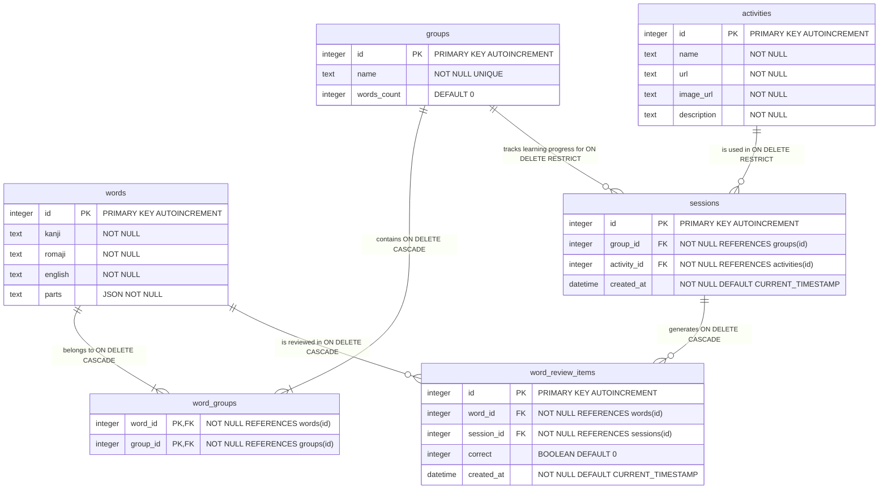

# Database Schema

## Entity Relationship Diagram

### SQLite Implementation Notes
- BOOLEAN fields are implemented as INTEGER (0 or 1)
- JSON fields are stored as TEXT
- Recommended indexes:
  - `word_review_items`: (word_id), (session_id)
  - `sessions`: (group_id), (activity_id)
  - Note: No need for word_groups index as it uses a composite primary key

The following is the schema of the database, written in Mermaid format:



A rendered version of the diagram is available alongside this file: ./Database-Schema.png.

## Table Definitions

### Words Table
```sql
CREATE TABLE words (
    id INTEGER PRIMARY KEY AUTOINCREMENT,
    kanji TEXT NOT NULL,
    romaji TEXT NOT NULL,
    english TEXT NOT NULL,
    parts TEXT NOT NULL -- JSON structure
);
```

Fields:
- `id`: Unique identifier for the word
- `kanji`: Japanese kanji/kana representation
- `romaji`: Romanized representation
- `english`: English translation
- `parts`: JSON structure containing word component analysis, structured as:
  ```json
  {
    "parts": [
      {
        "kanji": "古",
        "romaji": ["fu", "ru"]
      },
      {
        "kanji": "い",
        "romaji": ["i"]
      }
    ]
  }
  ```

### Groups Table
```sql
CREATE TABLE groups (
    id INTEGER PRIMARY KEY AUTOINCREMENT,
    name TEXT NOT NULL UNIQUE,
    words_count INTEGER DEFAULT 0
);
```

Fields:
- `id`: Unique identifier for the group
- `name`: Name of the word group (unique to prevent duplicate groups)
- `words_count`: Counter for the number of words in the group (helps with quick statistics)

### Word Groups Table (Junction)
```sql
CREATE TABLE word_groups (
    word_id INTEGER NOT NULL,
    group_id INTEGER NOT NULL,
    PRIMARY KEY (word_id, group_id),
    FOREIGN KEY (word_id) REFERENCES words (id) ON DELETE CASCADE,
    FOREIGN KEY (group_id) REFERENCES groups (id) ON DELETE CASCADE
);
```

Fields:
- `word_id`: Reference to the word
- `group_id`: Reference to the group
- Combined primary key ensures unique word-group combinations
- Cascade deletions ensure referential integrity

### Activities Table
```sql
CREATE TABLE activities (
    id INTEGER PRIMARY KEY AUTOINCREMENT,
    name TEXT NOT NULL,
    url TEXT NOT NULL,
    image_url TEXT NOT NULL,
    description TEXT NOT NULL
);
```

Fields:
- `id`: Unique identifier for the activity
- `name`: Name of the activity
- `url`: URL where the activity can be launched
- `image_url`: URL to the activity's thumbnail image
- `description`: Detailed description of the activity

### Sessions Table
```sql
CREATE TABLE sessions (
    id INTEGER PRIMARY KEY AUTOINCREMENT,
    group_id INTEGER NOT NULL,
    activity_id INTEGER NOT NULL,
    created_at DATETIME NOT NULL DEFAULT CURRENT_TIMESTAMP,
    FOREIGN KEY (group_id) REFERENCES groups (id) ON DELETE RESTRICT,
    FOREIGN KEY (activity_id) REFERENCES activities (id) ON DELETE RESTRICT
);
```

Fields:
- `id`: Unique identifier for the session
- `group_id`: Reference to the group being studied
- `activity_id`: Reference to the activity being used
- `created_at`: Timestamp when the session was created
- Note: RESTRICT on delete prevents loss of study history

### Word Review Items Table
```sql
CREATE TABLE word_review_items (
    id INTEGER PRIMARY KEY AUTOINCREMENT,
    word_id INTEGER NOT NULL,
    session_id INTEGER NOT NULL,
    correct INTEGER NOT NULL DEFAULT 0, -- BOOLEAN (0 or 1)
    created_at DATETIME NOT NULL DEFAULT CURRENT_TIMESTAMP,
    FOREIGN KEY (word_id) REFERENCES words (id) ON DELETE CASCADE,
    FOREIGN KEY (session_id) REFERENCES sessions (id) ON DELETE CASCADE
);
```

Fields:
- `id`: Unique identifier for the review item
- `word_id`: Reference to the word being reviewed
- `session_id`: Reference to the session
- `correct`: Boolean flag (0 or 1) indicating whether the review was correct
- `created_at`: Timestamp when the review was created

## Indexes

### Performance Indexes
```sql
CREATE INDEX idx_words_kanji ON words(kanji);
CREATE INDEX idx_words_romaji ON words(romaji);
CREATE INDEX idx_groups_name ON groups(name);
CREATE INDEX idx_sessions_created_at ON sessions(created_at);
CREATE INDEX idx_word_review_items_created_at ON word_review_items(created_at);
```

### Foreign Key Indexes
```sql
CREATE INDEX idx_word_groups_word_id ON word_groups(word_id);
CREATE INDEX idx_word_groups_group_id ON word_groups(group_id);
CREATE INDEX idx_sessions_group_id ON sessions(group_id);
CREATE INDEX idx_sessions_activity_id ON sessions(activity_id);
CREATE INDEX idx_word_review_items_word_id ON word_review_items(word_id);
CREATE INDEX idx_word_review_items_session_id ON word_review_items(session_id);
```

## Relationships and Cascade Behaviors

1. **Words ↔ Groups** (Many-to-Many)
   - Through `word_groups` junction table
   - A word can belong to multiple groups
   - A group can contain multiple words
   - Cascading deletes maintain referential integrity

2. **Groups ↔ Sessions** (One-to-Many)
   - A group can have multiple sessions
   - Each session belongs to one group
   - Delete restricted to preserve study history

3. **Activities ↔ Sessions** (One-to-Many)
   - An activity can be used in multiple sessions
   - Each session uses one activity
   - Delete restricted to preserve study history

4. **Sessions ↔ Word Review Items** (One-to-Many)
   - A session can have multiple word reviews
   - Each word review belongs to one session
   - Cascading deletes clean up related reviews

5. **Words ↔ Word Review Items** (One-to-Many)
   - A word can have multiple reviews
   - Each review is for one word
   - Cascading deletes clean up related reviews
