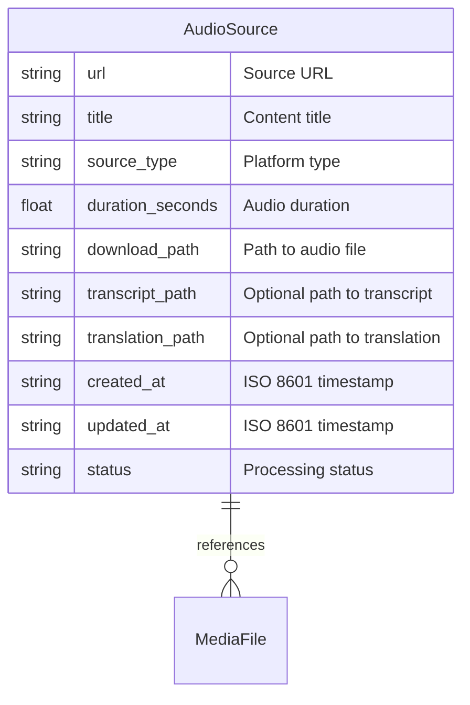

# Database Schema

## Document Structure Overview

### TinyDB Implementation Notes
- All data is stored in JSON format
- Timestamps are stored as ISO 8601 strings
- Document IDs are auto-generated integers
- Files are referenced by relative paths from workspace root
- Status field uses predefined string values

The following is the schema of the database, written in Mermaid format:



A rendered version of the diagram should be generated alongside this file: ./Database-Schema.png.

## Collection Definitions

### Sources Collection
The main collection storing audio source information:

```python
AudioSource = {
    "url": str,              # Source URL (unique)
    "title": str,           # Content title
    "source_type": str,     # e.g., "youtube", "spotify"
    "duration_seconds": float,
    "download_path": str,    # Relative path from workspace root
    "transcript_path": Optional[str],
    "translation_path": Optional[str],
    "created_at": str,      # ISO 8601 timestamp
    "updated_at": str,      # ISO 8601 timestamp
    "status": str          # Current processing status
}
```

Fields:
- `url`: Unique identifier for the source content
- `title`: Human-readable title of the content
- `source_type`: Platform or source type identifier
- `duration_seconds`: Length of audio in seconds
- `download_path`: Path to downloaded audio file
- `transcript_path`: Optional path to generated transcript
- `translation_path`: Optional path to generated translation
- `created_at`: Timestamp when record was created
- `updated_at`: Timestamp of last modification
- `status`: Current processing status

### Status Values
The `status` field can have the following values:
- `"pending"`: Initial state, URL validated but not processed
- `"downloaded"`: Audio file has been downloaded
- `"transcribed"`: Transcript has been generated
- `"translated"`: Translation has been completed
- `"error"`: Processing failed (additional error info in future)

## File Organization

### Media Files
While not stored in the database, the application manages several types of files referenced by database records:

1. **Audio Files** (`media/sources/`)
   - Original downloaded content
   - Named using sanitized title or content ID
   - Various audio formats supported

2. **Transcript Files** (`media/transcripts/`)
   - Generated Japanese transcripts
   - JSON format with timestamps
   - Named to match source audio file

3. **Translation Files** (`media/translations/`)
   - Generated English translations
   - JSON format with alignments
   - Named to match source audio file

## Document Lifecycle

### Creation
```python
{
    "url": "https://example.com/podcast-1",
    "title": "Sample Podcast",
    "source_type": "youtube",
    "duration_seconds": 300.0,
    "download_path": "",
    "transcript_path": None,
    "translation_path": None,
    "created_at": "2024-02-23T12:00:00Z",
    "updated_at": "2024-02-23T12:00:00Z",
    "status": "pending"
}
```

### After Download
```python
{
    # ... previous fields ...
    "download_path": "media/sources/sample-podcast.mp3",
    "updated_at": "2024-02-23T12:01:00Z",
    "status": "downloaded"
}
```

### After Transcription
```python
{
    # ... previous fields ...
    "transcript_path": "media/transcripts/sample-podcast.json",
    "updated_at": "2024-02-23T12:02:00Z",
    "status": "transcribed"
}
```

### After Translation
```python
{
    # ... previous fields ...
    "translation_path": "media/translations/sample-podcast.json",
    "updated_at": "2024-02-23T12:03:00Z",
    "status": "translated"
}
```

## Query Patterns

### Common Queries
```python
# Get source by URL
Source = Query()
db.sources.get(Source.url == target_url)

# Get sources by status
db.sources.search(Source.status == "pending")

# Get sources with transcripts
db.sources.search(Source.transcript_path.exists())

# Get sources by type
db.sources.search(Source.source_type == "youtube")
```

### Update Patterns
```python
# Update status
db.sources.update(
    {"status": "downloaded", "updated_at": current_time},
    doc_ids=[doc_id]
)

# Update paths
db.sources.update(
    {
        "transcript_path": new_path,
        "status": "transcribed",
        "updated_at": current_time
    },
    doc_ids=[doc_id]
)
```

## Data Integrity

### Constraints
- URLs should be unique within the sources collection
- Status values must be one of the predefined states
- Timestamps must be valid ISO 8601 strings
- File paths must be relative to workspace root
- Required fields cannot be null or empty strings

### File Management
- File paths in database must correspond to actual files
- File deletions should update database records
- Orphaned files should be cleaned up periodically
- Media directories are created if they don't exist

## Future Considerations

### Potential Enhancements
1. **Error Handling**
   - Add error message field
   - Track retry attempts
   - Store error timestamps

2. **Media Metadata**
   - Audio format details
   - Quality metrics
   - Processing parameters

3. **User Data**
   - Progress tracking
   - Favorites/bookmarks
   - Study history

4. **Migration Path**
   - Schema for SQLite migration
   - Data export format
   - Backup strategy
