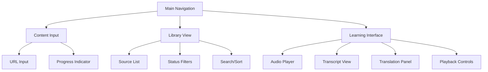

# Frontend Design Specification

## Overview

The frontend interface is built with Streamlit, providing an intuitive learning environment for Japanese audio content. The design prioritizes ease of use while offering powerful features for language learning.

## Layout Structure



## Component Specifications

### 1. Main Navigation
- Simple tab-based navigation
- Tabs:
  - Add Content
  - Library
  - Study Session

### 2. Content Input Page
```
┌─────────────────────────────────┐
│ Add New Content                 │
├─────────────────────────────────┤
│ ┌───────────────────────────┐   │
│ │ Enter URL                 │   │
│ └───────────────────────────┘   │
│ [ Submit ]                      │
│                                 │
│ Processing Status:              │
│ [===========         ] 50%      │
│ Current Step: Transcribing...   │
└─────────────────────────────────┘
```

Features:
- URL input field with validation
- Source type detection
- Progress indicator for processing steps
- Error feedback
- Processing status updates

### 3. Library View
```
┌─────────────────────────────────┐
│ My Library        [Search ▼]    │
├─────────────────────────────────┤
│ Filters: □All □Ready □Pending   │
│                                 │
│ ┌─────────────────────────────┐ │
│ │ Title 1                   ▶ │ │
│ │ 5:30 • Completed           │ │
│ └─────────────────────────────┘ │
│ ┌─────────────────────────────┐ │
│ │ Title 2                   ▶ │ │
│ │ 3:45 • Transcribing...     │ │
│ └─────────────────────────────┘ │
└─────────────────────────────────┘
```

Features:
- Grid/list view of audio sources
- Status indicators
- Duration and progress information
- Quick-play buttons
- Search and filter options
- Sort by date/title/status

### 4. Learning Interface
```
┌─────────────────────────────────┐
│ Title                    ⚙️ 🔍  │
├─────────────────────────────────┤
│ [▶️] 0:00 ─────○──── 5:30 1x   │
│                                 │
│ Transcript                      │
│ ┌─────────────────────────────┐ │
│ │ 今日は...                   │ │
│ │ [Currently playing line]    │ │
│ │ これは...                   │ │
│ └─────────────────────────────┘ │
│                                 │
│ Translation                     │
│ ┌─────────────────────────────┐ │
│ │ Today...                    │ │
│ │ [Translation of line]       │ │
│ │ This is...                  │ │
│ └─────────────────────────────┘ │
└─────────────────────────────────┘
```

Features:
- Professional audio player controls
- Speed adjustment (0.5x - 2x)
- Synchronized transcript highlighting
- Click-to-translate functionality
- Repeat section controls
- Font size adjustment
- Dark/light mode toggle

### 5. Settings Panel
```
┌─────────────────────────────────┐
│ Settings                     ✕  │
├─────────────────────────────────┤
│ Display                         │
│ ○ Side-by-side                 │
│ ○ Transcript only              │
│ ○ Translation only             │
│                                 │
│ Playback                       │
│ □ Auto-pause after line        │
│ □ Show romaji                  │
│ □ Highlight current word       │
└─────────────────────────────────┘
```

Features:
- Display preferences
- Playback behavior settings
- Font size controls
- Audio settings
- Interface customization

## Interactive Features

### 1. Transcript Interaction
- Click word for instant translation
- Double-click line to repeat
- Highlight current word/line
- Optional romaji display
- Adjustable font size

### 2. Audio Controls
- Play/Pause
- Skip forward/back (5/10 seconds)
- Speed control (0.5x - 2x)
- Repeat section mode
- Volume control
- Waveform visualization

### 3. Learning Tools
- Word/phrase saving
- One-click replay of current line
- Toggle between JP/EN
- Progress tracking
- Difficulty indicators

## Responsive Design

### Desktop Layout
- Side-by-side transcript and translation
- Persistent audio controls
- Full keyboard shortcuts
- Multi-column library view

### Tablet Layout
- Stacked transcript/translation
- Collapsible panels
- Touch-optimized controls
- Grid library view

### Mobile Layout
- Single column layout
- Bottom-fixed audio controls
- Swipe gestures
- List library view

## State Management

### Application States
1. **Content Loading**
   - URL validation
   - Download progress
   - Processing status

2. **Library Management**
   - Filter state
   - Sort preferences
   - Search queries

3. **Study Session**
   - Current position
   - Playback speed
   - Display preferences
   - Selected text

### Progress Tracking
- Current position in audio
- Completed sections
- Study time
- Interaction history

## Accessibility Features

- Keyboard navigation
- Screen reader support
- High contrast mode
- Adjustable text size
- Audio visualization
- Customizable colors

## Error Handling

### User Feedback
- Invalid URL messages
- Processing errors
- Network issues
- File access problems

### Recovery Options
- Retry failed downloads
- Alternative source options
- Manual transcript entry
- Offline mode support

## Future Enhancements

1. **Study Features**
   - Vocabulary lists
   - Practice exercises
   - Progress statistics
   - Spaced repetition

2. **Social Features**
   - Content sharing
   - Progress sharing
   - Community translations
   - Difficulty ratings

3. **Advanced Tools**
   - Voice recording
   - Pronunciation comparison
   - Grammar analysis
   - Custom study plans
